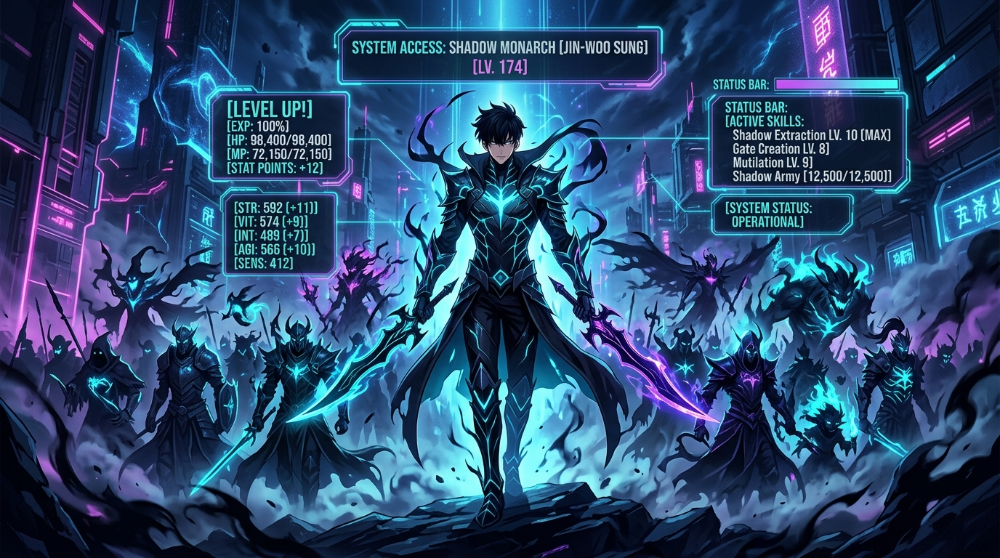
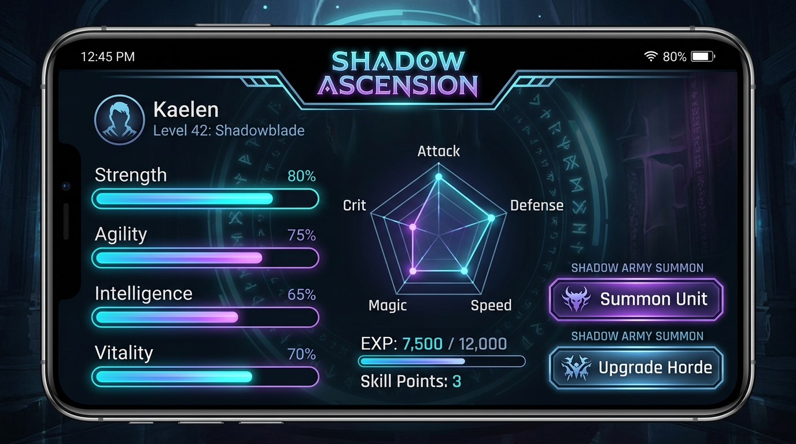
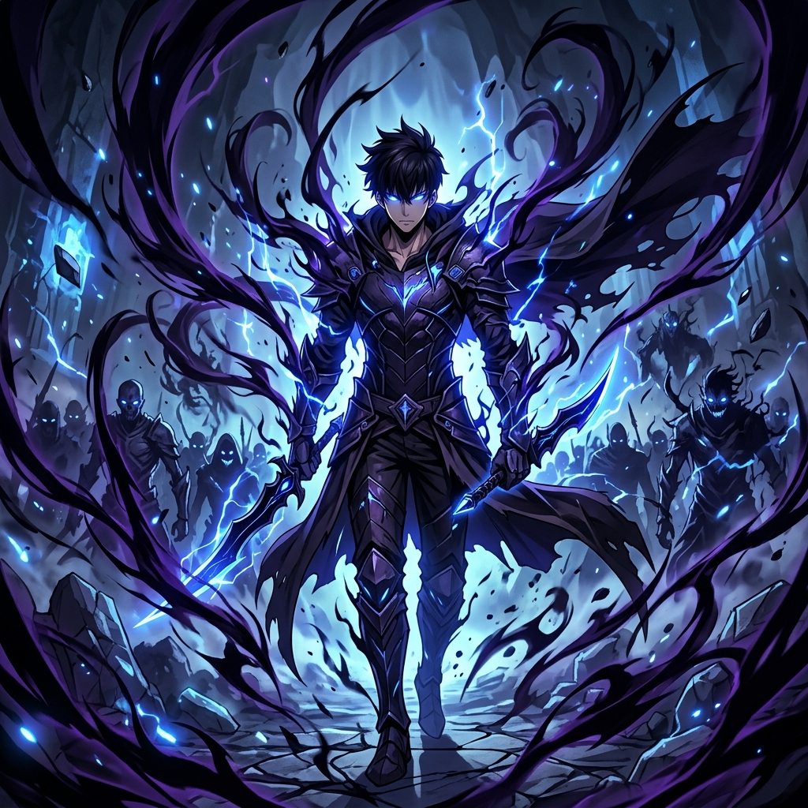

# 🌌 Shadow Ascension

<p align="center">
  
</p>

## 📌 Project Overview
**Shadow Ascension** is an immersive, high-fidelity dark-fantasy RPG habit-tracking and productivity application built for Android. Inspired by legendary LitRPG and progression fantasy universes like *Solo Leveling*, it converts your real-world daily grind, physical training, and study routines into epic gate quests. 

Complete quests, gain Experience Points (XP) and Gold, summon powerful Echo Guardians, buy legendary equipment, unlock massive dungeon gates, and ascend from an E-Rank hunter to a supreme Shadow Monarch.

---

## 🎨 Visual Identity & Preview
Experience a gorgeous, highly styled cyberpunk-gothic design pairing a deep slate canvas with glowing neon cyan, steel blue, and dark purple accents.

<p align="center">
  
  
</p>

---

## 🚀 Key Capabilities & Modules

### 1. Daily Quests Tracker (`Quests Tab`)
*   **Gate Quest Management**: Add, edit, and check off daily habits.
*   **Dynamic Complexity Analyzer**: The system reads your quest title and details, automatically classing them from **D-Rank** (basic tasks) up to **S-Rank** (monumental milestones) with rewards directly scaling to complexity.
*   **Progressive Overload Engine**: Habit loops scale automatically. For instance, the **Daily Pushups Challenge** computes dynamic weekly targets (e.g. `+10` pushups per week) based on the date of habit registration to ensure physical scaling.
*   **Automated Midnight Assignment**: The System automatically resets completed statuses at midnight and assigns default daily quests (e.g. computer science study objectives, hydration guidelines, core algorithm gates, and progressive physical training) so players wake up to freshly populated gates.
*   **Interactive Alter Gate Dialog**: Edit existing quests dynamically with real-time complexity rank preview, resource updates, and stat alignment changes.

### 2. Player Status & Radar Chart (`Stats Tab`)
*   **Stat Attribute Indexes**: Distribute points into 5 core stats:
    *   **STRENGTH** (Boosts physical capabilities and pushup capacity)
    *   **AGILITY** (Enhances speed and coordination)
    *   **INTELLIGENCE** (Increases memory retention and CS study efficiency)
    *   **VITALITY** (Improves endurance, stamina, and hydration health)
    *   **SENSE** (Calibrates mindfulness, focus, and reaction timing)
*   **Custom Radar Chart**: View your character's attribute distribution mapped beautifully on a custom-drawn trigonometric radar polygon graph.
*   **Chronicle Logs**: Scroll through a detailed timestamped ledger containing every quest completed, gold acquired, and attribute milestone achieved.

### 3. Soul Skill Tree (`Skills Tab`)
*   **Allocate Stat Points**: Spend attribute points gained from leveling up.
*   **Aura & Titles Unlock**: Track your overall progression ranking from E-Rank through S-Rank, unlocking unique prestige bonuses along the way.

### 4. Rest Shop (`Shop Tab`)
*   **Gold Economy**: Spend gold gained from gates on custom self-made real-world rewards, consumables, or dynamic game assets.
*   **Rewards Portal**: Create customized rewards with descriptive icons, gold values, and tracking limits.

### 5. System Hub Screen (`Hub Tab`)
The central core of the system containing advanced modules:
*   **AI Quest Gen**: Powered by the **Gemini API**, describe your real-life goal (e.g. *"learning advanced systems design"* or *"preparing for an marathon"*), and watch the system generate immersive, lore-aligned questlines automatically.
*   **Dungeon Gates & Boss Raid**: Venture into unstable Gates, battling major bosses (e.g., Ice Elves, Shadow Orcs, and Crimson Wyverns) using your stats to test your limits. Gaining massive gold and prestige materials.
*   **Shadow Army Commander**: Summon and command legendary **Echo Guardians** (e.g., Igris, Tank, Iron, Beru). Feed them soul essence, level up their combat statistics, and unlock deep military upgrades.
*   **Armory Equipment Store**: Purchase and equip gear (Weapons, Armor, Helms, and Rings) that permanently inject massive stat bonuses into your core character radar sheet.
*   **Dilation Focus Timer**: Tap into temporal dilation (Focus Mode) using custom countdown clocks, ambient gothic white-noise focus loops, and adjustable intervals to block out real-world noise.
*   **Prestige Reawakening**: Reach Level 15+ to reset your character level, retaining permanent passive stat multipliers and a legendary title suffix.

---

## 🛠️ Technical Stack & Architecture
*   **Platform**: Android (Native Kotlin)
*   **UI Framework**: Jetpack Compose (Material Design 3 with custom canvas drawing)
*   **Local Caching**: Room Database (SQLite) with KSP compilation
*   **Architecture**: MVVM (Model-View-ViewModel) + Repository Pattern with Kotlin Coroutines & Flow
*   **Networking**: Retrofit, OkHttp, and Moshi (JSON parser)
*   **Asynchronous State**: StateFlow and SharedFlow mapping state safely across screens
*   **Build Engine**: Gradle (Kotlin DSL) featuring the Secrets Gradle Plugin for secure environment variables

---

## 🎞️ Screencast & Demo Video Placeholder
For a complete visual walkthrough and demo video of the application in action (capturing the fluid transitions, battle animations, and real-time radar chart updates), refer to the dynamic preview link below or record a video of the running streaming emulator in AI Studio:

```
[Insert/Record Screencast Link Here]
```

---

## 📜 Development Logs & Implementation Progress
1.  **[Init] Core Foundation**: Built the Room Database layer with MVVM integration, setting up players, habits (quests), and combat mechanics.
2.  **[Visual] M3 Neon Interface**: Configured custom themes using deep slates, luminous neon highlights, custom fonts, and hand-crafted card containers.
3.  **[Feature] The Monarch's Hub**: Designed and integrated screens for Equipment, Shadow Army management, Regional maps, Dungeons, and Focus Mode.
4.  **[AI Layer] Gemini Integration**: Added an AI-driven fantasy quest developer utilizing server-side Gemini.
5.  **[Surgical] Habit Tracker & XP**: Completed the modular daily quest editor, allowing adding, custom editing, complexity estimation, and rewards execution.
6.  **[Automation] Midnight Scheduler**: Configured daily reset mechanisms with SharedPreferences to ensure new daily quest assignment triggers seamlessly on first-run or calendar date rollover.
